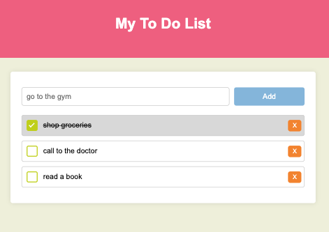

# My Task Management Application

Welcome to my task management application! This application allows you to efficiently organize and keep track of your tasks.

## Features

- Add new tasks with detailed descriptions.
- Mark tasks as completed.
- Delete tasks that you no longer need.
- Local storage to retain your tasks even after closing the browser.

## Screenshots

## Installation

1. Clone this repository to your local machine.
2. Open the `index.html` file in your web browser.

## Usage

- To add a new task, click on the "Add Task" button and fill out the form.
- To mark a task as completed, simply click on the checkbox next to the task.
- To delete a task, click on the delete button next to the task.

## Contributing

If you would like to contribute to this project, you are welcome to! Simply follow these steps:

1. Fork this repository.
2. Create a new branch (`git checkout -b feature/new-feature`).
3. Make your changes and commit them (`git commit -am 'Add a new feature'`).
4. Push the branch (`git push origin feature/new-feature`).
5. Open a pull request.

## Technologies Used

- HTML5
- CSS3
- JavaScript

## Credits

This project was created by [Nadine Estrella](https://github.com/nadinestrella).

